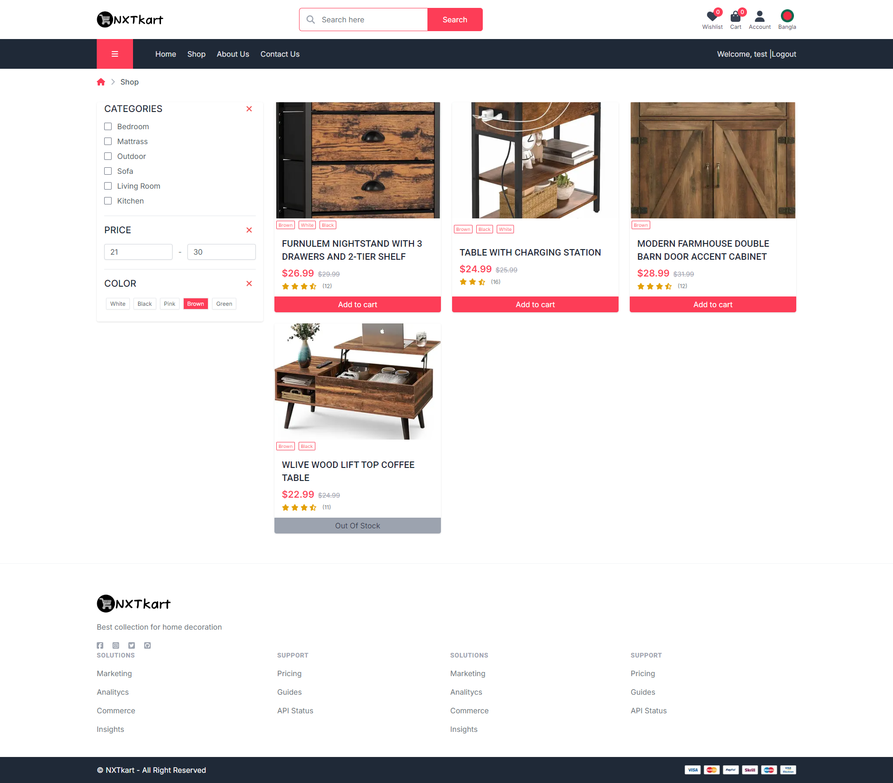
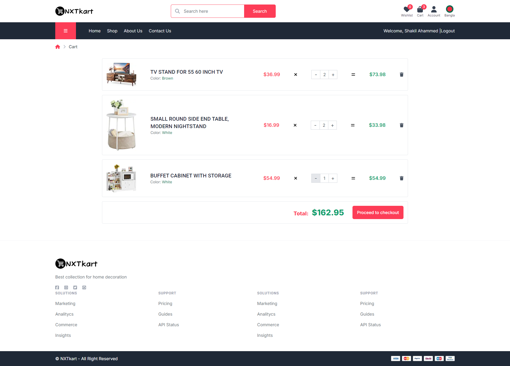
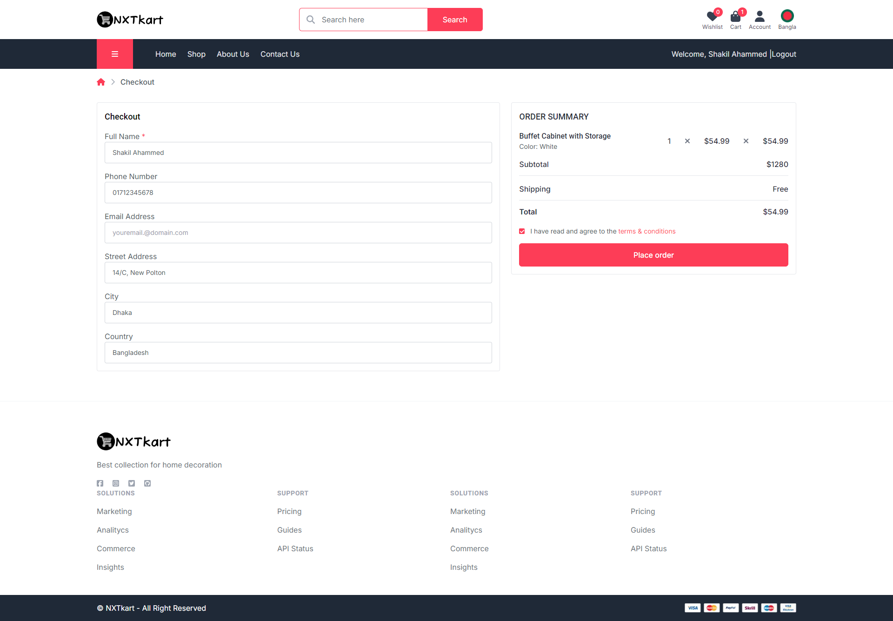
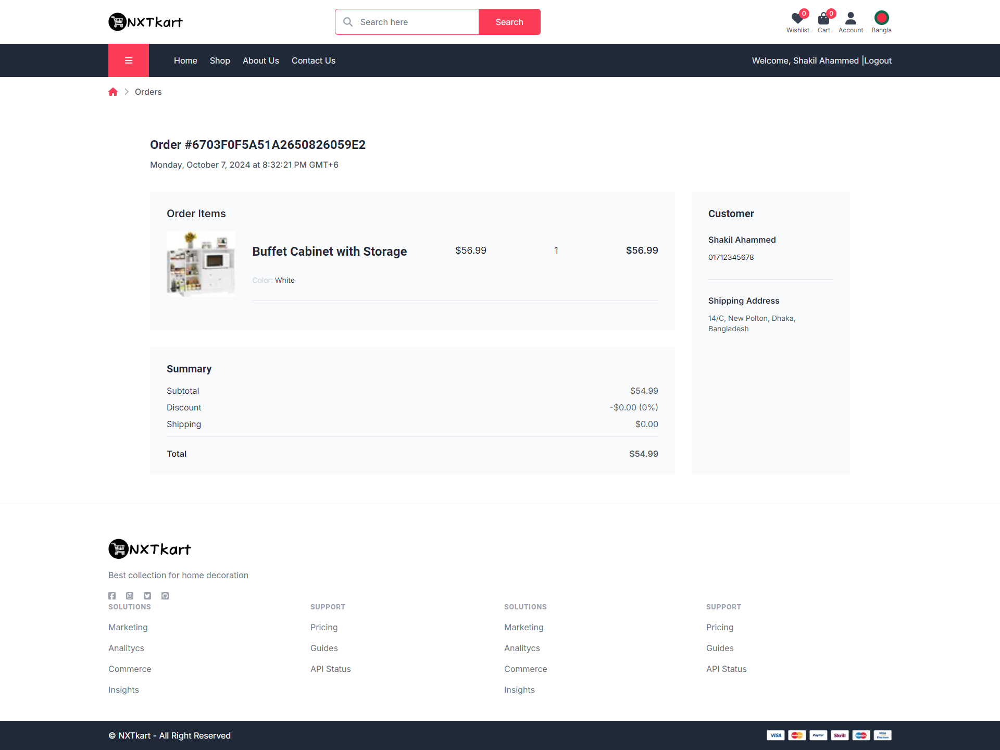
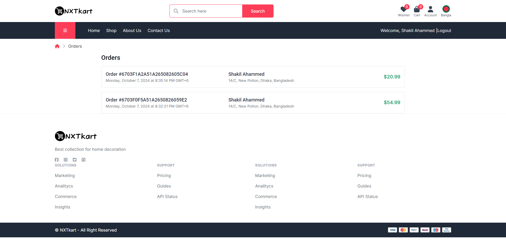
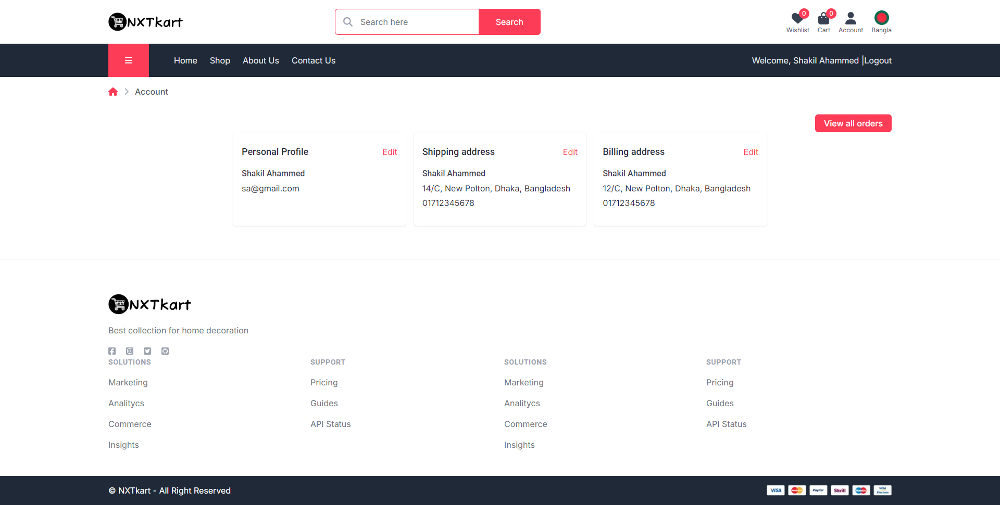

# Next.js Shopping Cart App

This is a fully functional shopping cart app built with Next.js. It includes user authentication with access and refresh tokens, dynamic product management, and a responsive UI. Users can add products to their cart and wishlist, with features like filtering by category, price, size, and color. The app supports real-time cart updates, internationalization (English/Bengali), invoice generation (PDF), and stock management. SEO optimization and social media sharing features are also implemented.

## Features

-   **User Authentication**: Secure login system using Access and Refresh Tokens to manage user sessions effectively. Prevents unauthorized actions such as adding to cart or wishlist without being logged in.

-   **Home Page Integration**: The "SHOP BY CATEGORY," "TRENDING PRODUCTS," and "TOP NEW ARRIVAL" sections are dynamically loaded from the database, offering users relevant and fresh content.

-   **Product Details**: Clicking a product displays all relevant information pulled from the database, including images, description, price, and related products based on tags or categories.

-   **Add to Cart & Wishlist**: Fully functional buttons that dynamically update cart and wishlist counts in the Navbar. Items can be added to the cart or wishlist only when the user is logged in. Attempting to add items without logging in redirects the user to the login page, and post-login, the items are automatically added to the appropriate list.

-   **Social Media Sharing**: Share products directly from the product details page using social media share buttons.

-   **Related Products**: Related products are shown based on category, tags, or keywords to increase engagement and drive additional purchases.

-   **Search Functionality**: A fully integrated search feature that filters products by categories, price range, size, and color. Search results are displayed according to the shop template for a cohesive user experience.

-   **Accounts Management**: Private routes for users to manage their profiles, shipping address, and billing address. Users can update these details at any time.

-   **Checkout System**: The checkout page displays items in the cart and includes form validation for user details. A successful order submission shows a confirmation message and generates an invoice.

-   **Invoice Generation**: After placing an order, a PDF invoice is generated using libraries like PDF-LIB. Users can download the invoice or receive it via email.

-   **Stock Management**: Real-time stock control ensures that products show as "Out of Stock" when unavailable. Inventory is reduced upon adding to cart, and items are released back into stock if not purchased within a set time.

-   **SEO Optimized**: The home page and product details pages are fully optimized for search engines to ensure visibility and better rankings.

-   **Internationalization**: Supports multi-language capabilities, with English and Bengali translations for all elements of the website.

## Installation

1. Clone the repository:

```bash
   git clone https://github.com/shaakilahammed/next-shopping-cart-app.git
```

2. Navigate to the project directory:

```bash
   cd next-shopping-cart-app
```

3. Install dependencies:

```bash
   npm install
```

4. Run the development server:

```bash
   npm run dev
```

5. Open your browser at http://localhost:3000 to view the app.

## Screenshot

#### Homepage


#### Products page



#### Single Product page


#### Cart page



#### Checkout page



#### Invoice



#### Order List Page



#### Profile Page



## Technologies Used

-   Next.js
-   React
-   Tailwind CSS
-   NextAuth
-   MongoDB

## Contributing

Pull requests are welcome. For major changes, please open an issue to discuss what you would like to change.
